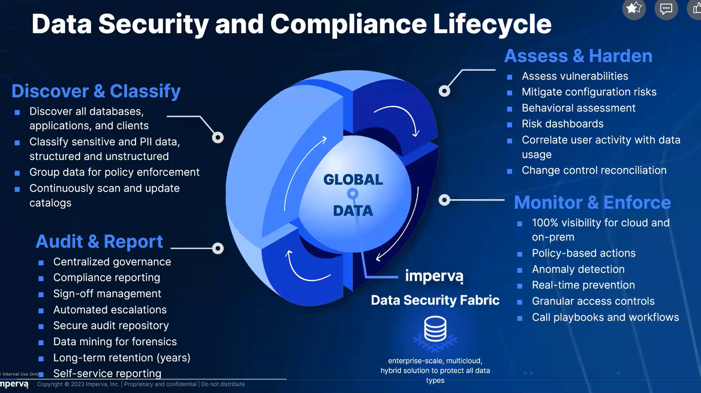

# Data security fabric

## Data centric lifecycle

Process này sẽ chạy liên tục vì mỗi ngày data sẽ đổi mới và các data đó sẽ phải được phân loại

### Bước 1: Tìm kiếm data và phân loại nó

- Ta cần phân loại nó ra thành Structured data, unStructured hoặc semi
- Sau đó sẽ phân loại theo các tiêu chuyển tuân thủ như **PII/PHI/SOX/PCI/HIPAA**

### Bước 2: Assess và harden

Imperva DSF thì được thiết kế để quản lý cả các rủi ro có thể là không thể sửa ngay lập tức.

Nó sẽ chạy 1 bài test và sẽ auto phân tích các biểu đồ

- Tìm xem có các risks j có thể có kiểu external vul, open port

## Vulnerability management

Có tầm 7k bài test để test database

Có 3 loại lỗ hổng là database, os và config mà thằng này sẽ quét

### Bước 3: mitigate cái rủi ro và thắt chặt chính sách mitigate là giảm nhẹ

Cái hình này thì nó mô tả là data từ cloud sẽ đi qua cái angentless gw còn on prem thì qua agent như bthg sau đó đến cái hub và xử lý mấy cái ở trên sẽ là mấy cái hub dùng để xử lý ví dụ splunk sẽ để kiểm tra xem có encrypted không