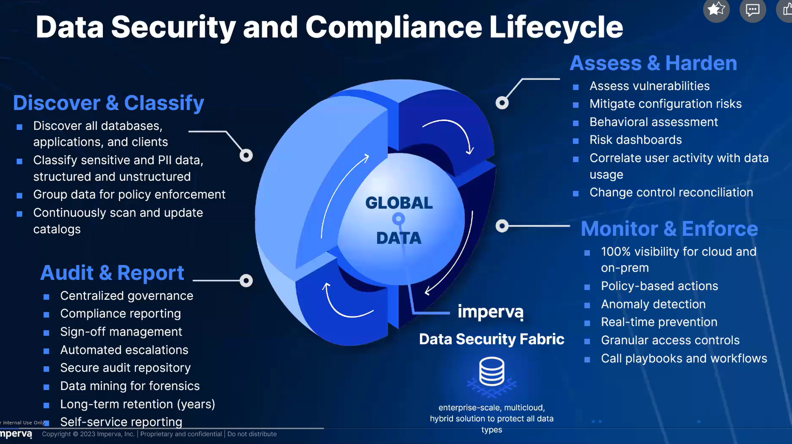

# Data security fabric

## I. Data centric lifecycle

Process này sẽ chạy liên tục vì mỗi ngày data sẽ đổi mới và các data đó sẽ phải được phân loại

### Bước 1: Tìm kiếm data và phân loại nó

- Ta cần phân loại nó ra thành Structured data, unStructured hoặc semi
- Sau đó sẽ phân loại theo các tiêu chuyển tuân thủ như **PII/PHI/SOX/PCI/HIPAA**

### Bước 2: Assess và harden

Imperva DSF thì được thiết kế để quản lý cả các rủi ro có thể là không thể sửa ngay lập tức.

Nó sẽ chạy 1 bài test và sẽ auto phân tích các biểu đồ

- Tìm xem có các risks j có thể có kiểu external vul, open port

## Vulnerability management

Có tầm 7k bài test để test database

Có 3 loại lỗ hổng là database, os và config mà thằng này sẽ quét

### Bước 3: mitigate cái rủi ro và thắt chặt chính sách mitigate là giảm nhẹ

Cái hình này thì nó mô tả là data từ cloud sẽ đi qua cái angentless gw còn on prem thì qua agent như bthg sau đó đến cái hub và xử lý mấy cái ở trên sẽ là mấy cái hub dùng để xử lý ví dụ splunk sẽ để kiểm tra xem có encrypted không

# II. How we do it

## 1. Tạo 1 cơ sở dữ liệu thống nhất

- Cơ sở dữ liệu của imperva sẽ được lấy dữ liệu từ nhiều nguồn khác nhau, thậm chí có thể từ các model khác như IBM, …
- Và với mô hình này ta có thể bắt đầu việc tạo các báo cáo, xây dựng sơ đồ hành vi.

<aside>
❗

Vì đã có model này nên ta không cần lo về việc lấy dữ liệu từ các nguồn khác nhau như on-premise hay cloud, tất cả đã được DSF làm

</aside>

## 2. Bước 2: tìm xem ta muốn bảo vệ data, dữ liệu nào

- Việc đầu tiên là cần tìm xem kho dữ liệu (data repositories) nằm ở đâu trên mạng lưới dữ liệu, sau đó ta có thể bắt đầu tìm kiếm các dữ liệu nhạy cảm đang ở đâu
- Phân loại xem các dữ liệu đó dạng gì, ý nghĩa của chúng là gì. Trong khoảng thời gian này thì ta có thể dùng thêm 1 số con automation của DSF với chức năng “Learn from me” để nó học cách mình phân loại và sẽ áp dụng cho sau này.

## 3. Bước 3: Đánh giá lỗ hổng và quyền của người dùng

- Với các lỗ hổng của cơ sở dữ liệu: Có bộ các bài test đã được định nghĩa sẵn từ trước ứng dụng các chuẩn như CIS, DISA, … hay từ chính imperva lab
- Về quyền của người dùng ta có 4 khía cạnh cần xem xét:
    - Who is
    - What right
    - Is sensitive
    - When used

## 4. Bước 4: Đảm bảo hành vi tuân thủ

### Set policy

Vì imperva thì luôn luôn đảm bảo việc này dựa vào các quy định (policy)

<aside>
✅

Tạo lên, dựng lên các policies để tìm ra các lỗ hổng, trường hợp không tuân thủ

</aside>

### Alert

Và khi có được các policies rồi thì ta sẽ được thông báo, cảnh báo về các trường hợp vi phạm. Ở đây ta có thể block 1 số vi phạm, action.

### Report

Và khi ta cần báo cáo các hành vi này thì tính năng real-time exploration cho phép chúng ta truy vấn ngay dữ liệu giám sát đang lưu trữ mà không cần phục hồi từ back-up hay export ra trước 

⇒ Phản ánh được tình hình hiện tại

### Retain

Với việc lưu trữ thì rất đơn giản do ta đã có được các công cụ automation, ta có thể tùy chỉnh được cách dữ liệu được lưu, thời gian lưu hay thậm chí là khối lượng dữ liệu được lưu.

**Ví dụ:**

## 5. Bước 5: Hiển thị các mối đe dọa để có cách khắc phục

- Với các biện pháp thông thường như SIEM hay UEBA thường chỉ dừng ở tầng người dùng
    
    ⇒ Ta sẽ chỉ biết được ai là người thực hiện nhưng họ có các hành động gì thì không thể biết được
    
- Với DSF, ta có khả năng xem xét, phân tích người dùng và cả dữ liệu
    
    ⇒ Ta có thể biết được cách họ tân công, thay đổi dữ liệu như nào, thời gian họ làm, …
    
    ⇒ Hiểu được những mối nguy hại sâu xa hơn
    
- Và từ đây dữ liệu sẽ được chuyển lên DRA phân tích và hiển thị cho người dùng với 1 UI thân thiện.

## 6. Bước 6: làm đơn giản hóa việc tìm data

- Một số quy trình thủ công như báo cáo rủi ro, quy trình giảm thiểu rủi ro có thể được thay thế bằng 1 số khả năng tự động hóa
- Ngoài ra cũng kết hợp với ngữ cảnh (metadata) để giúp hiểu rõ bối cảnh sự kiện