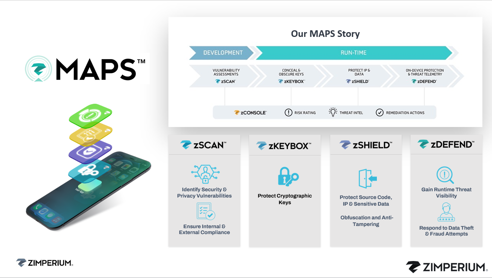

# zMaps

> **Zimperium MAPS (Mobile Application Protection Suite)** là bộ giải pháp bảo mật ứng dụng di động giúp **bảo vệ mã nguồn, ngăn tấn công khi runtime, phát hiện mối đe dọa và đảm bảo vận hành an toàn, dễ dàng.**
> 

# **Tổng quan sản phẩm**

## 4 năng lực chính của sản phẩm và bài toán nó xử lý:

1. Code / Intellectual Property Protection (Offline Attack)
- Bảo vệ mã nguồn:
    - **Reverse Engineering:** Hacker giải mã file APK/IPA để đọc mã nguồn hoặc logic kinh doanh.
    - **Tampering:** Sửa đổi ứng dụng (chèn malware, bỏ qua cơ chế xác thực, gỡ quảng cáo, v.v.).
    - **Repackaging:** Đóng gói lại app giả mạo và phát tán.
- MAPS dùng các kỹ thuật:
    - **Code obfuscation** (làm rối mã, biến đổi logic để khó đọc).
    - **Integrity checks** (kiểm tra tính toàn vẹn).
    - **Anti-debugging / Anti-hooking** (chặn debug hoặc hook bằng Frida, Magisk, v.v.).
1. Run-Time Protection (Online Attack)
- **Bảo vệ ứng dụng khi đang chạy** (runtime) khỏi các mối đe dọa trên **thiết bị, mạng và malware** như:
    - Ứng dụng chạy trên **thiết bị đã root/jailbreak**.
    - **Kết nối mạng không an toàn**, tấn công MITM, proxy, DNS spoofing.
    - **Malware can thiệp vào tiến trình ứng dụng**, keylogger hoặc overlay attack.
- MAPS cung cấp SDK (zShield/zDefend) mà bạn **tích hợp vào app**, cho phép nó **tự phát hiện và phản ứng** ngay trong runtime.
1. Threat Visibility
- Có zConsole nhìn được tường tận các mối đe dọa đang xảy ra:
    - Thiết bị root, mạng nào không an toàn, app nào đang bị tấn cống, …
    - Hiển thị log, trending và phân tích ở zconsole
    - Hỗ trợ tích hợp SIEM
1. Ease of Operations
- **Triển khai và vận hành dễ dàng**, vì:
    - Tích hợp SDK vào app là **no code / low code** (chỉ cần vài dòng).
    - Có thể tích hợp vào **CI/CD pipeline** để tự động bảo vệ app khi build.
    - Quản lý qua **cloud-based console**, không cần hạ tầng phức tạp.

# Chi tiết sản phẩm

Cơ bản thì nó có 4 module chính là zScan, zKeybox, zShield và zDefend

Ở giai đoạn phát triển ta có zScan để quét trước code tìm ra các lỗ hổng bảo mật giống quét của thg Dam

Tiếp theo ở giai đoạn Run-time sẽ có 3 thằng còn lại để bảo vệ

- zKeybox để giữ các mã khóa và thông tin nhạy cảm trong ứng dụng khỏi bị trích xuất hoặc giải mã.
- zShield sẽ sửa cái source code của app để ngăn app không bị tấn công bằng các obfuscation (làm rối mã code) hoặc biện pháp anti-tampering
- zDefend để chạy runtime threat như là app bị cài vào máy bị jailbreak, app bị tampering, app bị cài ở nguồn cài không uy tín, app vào máy có mạng ko tốt

Cuối cùng thì thằng zConsole sẽ là nơi quản trị

Hình này sẽ mô tả chính xác hơn về cách hiểu của cái con sản phẩm này

Hình này sẽ nói về việc mỗi module được áp dụng trong từng giai đoạn của dự án

- Đầu tiên ở plan và develop zDefend sẽ cung cấp threat có thể có để có build app, zKeybox sẽ đảm nhiệm vai trò lưu trữ các mã khóa qtrong
- Tiếp đến sẽ có 1 vòng lặp ở build và test sẽ liên tục tạo các bài test để test và sửa lại cho đến khi hoàn thành
- Giữa giai đoạn hoàn thành và deploy zShield sẽ đi vào và sửa source code để ngăn tampering, … sau đó zScan sẽ quét lại lần nữa
- Và cuối cùng zDefend sẽ đảm nhận bảo vệ app theo thời gian thực

## zScan

zScan sẽ phân tích được cả mã tính và mã lúc chạy, thực thi

### Mã tĩnh

Ở đây cũng phân tích tìm ra lỗ hổng như dam:

- Dữ liệu nhạy cảm ở đâu
- Cơ chế nào dùng để mã hóa
- Code này này permision ở đâu
- Data thì được lưu như nào
- Nó “nói chuyện với SSL” ra sao

### Mã động

Cho thử vào môi trường ảo hóa để tìm tiếp các lỗ hổng như

- Thành phần dễ tổn thương
- Dữ liệu nào nó lấy từ ng dùng
- App send data qua đâu
- Có khả năng bị leak ko

zScan cũng có các tiêu chuẩn như **NIAP**, **GDPR**, **MASVS**

Với việc kết hợp zShield (làm rối mã code) và zDefend bảo vệ thời gian thực tức là cả ofline và online, ta có thể bảo vệ nhiều lớp, nôm na là toàn diện.

## Offline protection

Nó sẽ có 2 cái chính mà hacker dùng để tấn công vào app đó là reversing và tampering

### Reversing

> Cái này là hacker cầm đoạn apk sau đó đảo ngược từ đó ra mã nguồn
> 

Bảo vệ bằng cách:

- Làm rối mã nguồn
- Chống debug là chống việc người dùng mở f12 lên xem luồng chạy hoặc  1 công cụ nào đó
- Nén mã và làm đa dạng mã (nén mã là việc khiến cho 1 đoạn mã code bị nén lại và sẽ được khởi chạy/ thực thi qua 1 dạng loader nhỏ, đa dạng mã là việc khiến cho để làm được điều A thì có 3 4 cách, sẽ tạo ra nhiều cách như vậy)
- Và qtrong nhất là control flow flattening

### Tampering

> Đây là hacker trực tiếp vào sửa đổi luôn đoạn mã code
> 

Và nó bảo vệ bằng cách:

- Tự thêm các hàm checksum để kiểm tra có bị sửa file hoặc bộ nhớ ko
- **Anti-Debug & Anti-Hooking:** Phát hiện khi có debugger, Frida, Magisk can thiệp.
- Cơ chế kiểm tra chồng lấp (*Overlapping Checkers*) giúp phát hiện sửa đổi tinh vi. ( cơ chế này là việc làm cho code nó thành nhiều lớp và chèn các mã nhỏ vào từng lớp để kiểm tra, việc này giúp ta kiểm tra được nhiều trường hợp)

## Online protection

Cơ bản thì thằng zDefend hay nói rộng là zimperium sẽ bảo vệ app qua cơ chế là nhìn từ ngoài vào, sẽ là kiểu giám sát app của mình hoạt động ra sao chứ không như cách truyền thống sẽ đi từ trong ra là khi app nổ, app chết thì đi tìm các cách giải quyết dựa vào signature 

cái qtrong nhất là thg zim này không bắt người dùng phải cập nhật lại app khi có tấn công, áp dụng cả ml vào trong này để học hành vi tìm ra được các threat mà chưa có trong signature, 

Các cách tấn công sẽ được  cập nhật liên tục từ các threat mới

**Machine learning**

